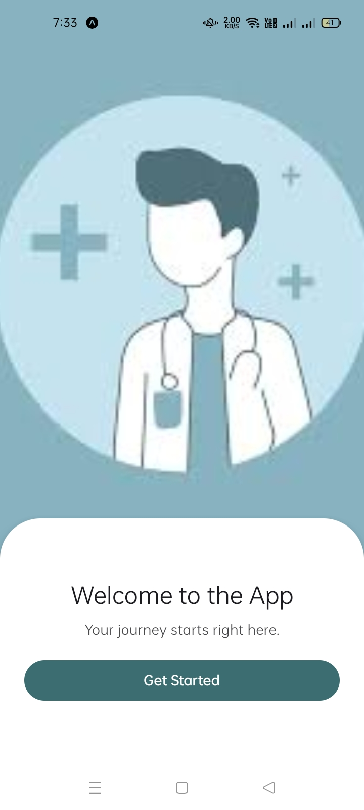
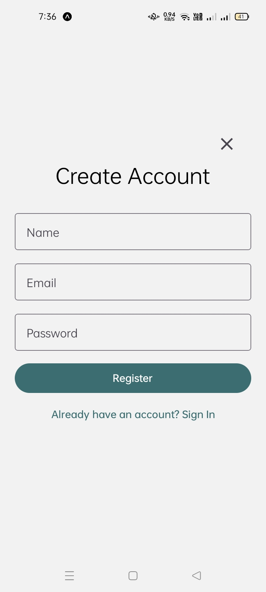
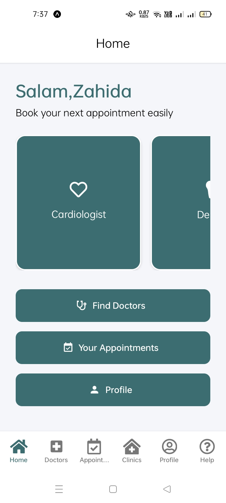
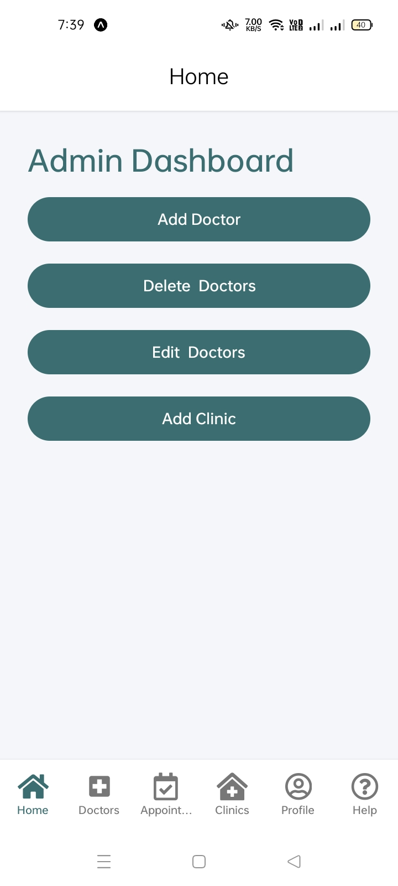
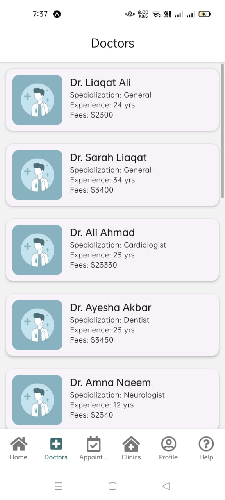
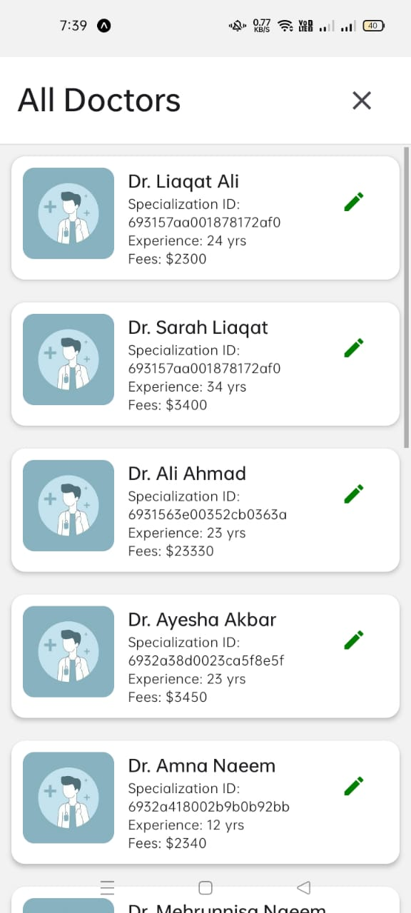
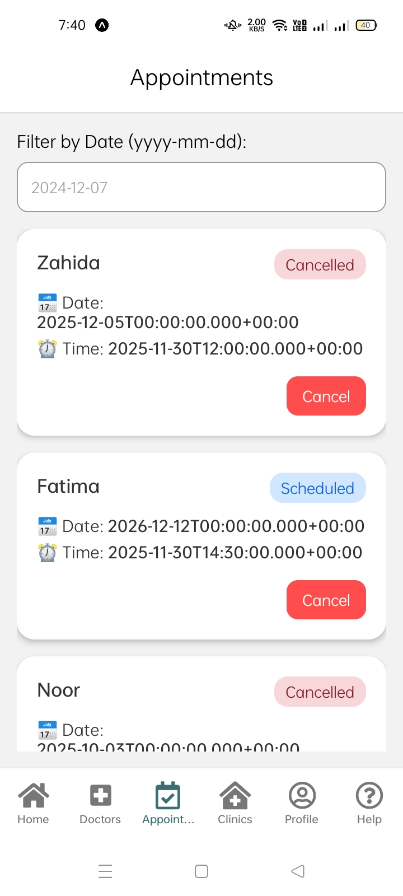
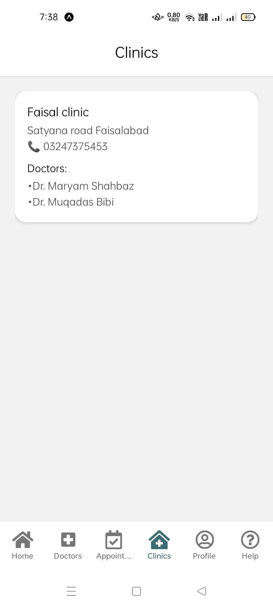

# 🏥 Doctor Appointment Booking App

A comprehensive React Native mobile application for booking doctor appointments, built with Expo and Appwrite backend. The app provides a seamless experience for patients to find doctors, book appointments, and manage their healthcare schedule.


## ✨ Features

### For Patients (Users)
- 🔐 **Secure Authentication** - Login and registration with email/password
- 👋 **Personalized Dashboard** - Welcome screen with user name
- 🏥 **Browse Doctors** - View doctors by specialization categories
- 📅 **Book Appointments** - Select doctor, date, and time
- 📋 **Appointment Management** - View and cancel appointments
- 🔍 **Filter Appointments** - Search by date
- 👤 **Profile Section** - User profile management

### For Administrators
- 📊 **Admin Dashboard** - Dedicated admin interface
- ➕ **Add Doctors** - Register new doctors with details
- ✏️ **Edit Doctors** - Update doctor information
- 🗑️ **Delete Doctors** - Remove doctors from system
- 🏢 **Manage Clinics** - Add and manage clinic locations

### Medical Specializations
- Cardiologist
- Dentist
- Neurologist
- General Practitioner
- Pediatrician

## 🚀 Tech Stack

| Technology | Purpose |
|------------|---------|
| **React Native** | Mobile app framework |
| **Expo** | Development platform |
| **Expo Router** | File-based navigation |
| **React Native Paper** | Material Design UI components |
| **Appwrite** | Backend server (Auth, Database) |
| **TypeScript** | Type safety |
| **React Native社区 Datetimepicker** | Date/Time selection |

## 📁 Project Structure

```
Doctor-Appointment-Booking-App/
├── app/
│   ├── _layout.tsx              # Root layout with providers
│   ├── index.tsx                # Welcome screen
│   ├── auth.tsx                 # Login/Register screen
│   ├── add-doctor.js            # Admin: Add new doctor
│   ├── edit-doctor.js           # Admin: Edit doctor details
│   ├── addclinic.js             # Admin: Add clinic
│   ├── doctor-detail.js         # Doctor profile & booking
│   ├── appointment-booking.js   # Booking form
│   ├── feedback.js              # Video call interface
│   ├── (tabs)/                  # Tab navigation
│   │   ├── home.tsx             # Main dashboard
│   │   └── appointment.js       # Appointments list
├── assets/
│   └── images/                  # App images and icons
├── lib/
│   └── appwrite.tsx             # Appwrite configuration
├── theme/
│   ├── theme.js                 # App theme
│   └── colors.js                # Color palette
├── auth-context.tsx             # Authentication context
├── package.json                 # Dependencies
├── app.json                     # Expo configuration
└── README.md                    # This file
```

## 🛠️ Installation

### Prerequisites
- Node.js (v18 or higher)
- npm or yarn
- Expo CLI
- Appwrite Server (self-hosted or cloud)

### Setup Steps

1. **Clone the repository**
   ```bash
   git clone <repository-url>
   cd Doctor-Appointment-Booking-App
   ```

2. **Install dependencies**
   ```bash
   npm install
   ```

3. **Configure Appwrite**
   
   Create a `.env` file in the root directory:
   ```env
   EXPO_PUBLIC_APPWRITE_ENDPOINT=https://cloud.appwrite.io/v1
   EXPO_PUBLIC_APPWRITE_PROJECT_ID=your-project-id
   ```

4. **Setup Appwrite Database**
   
   Create the following collections in your Appwrite database:
   
   | Collection Name | Attributes |
   |-----------------|------------|
   | **users** | userId, name, email, role |
   | **doctors** | firstName, lastName, email, phoneNumber, yearsOfExperience, fees, specializationId, ImageUrl |
   | **appointment** | doctorId, userId, name, phone, date, time, notes, status |
   | **clinics** | name, address, phone, isActive |
   | **admin** | email (for admin verification) |

5. **Run the app**
   ```bash
   # Start development server
   npx expo start

   # Run on Android
   npx expo start --android

   # Run on iOS
   npx expo start --ios

   # Run on web
   npx expo start --web
   ```

## 📱 Screens

### Authentication
| Screen | Description |
|--------|-------------|
| Welcome Screen | Landing page with "Get Started" button |
| Login Screen | Email/password authentication |
| Register Screen | New user registration with name, email, password |

### User Features
| Screen | Description |
|--------|-------------|
| Home Dashboard | Personalized greeting, specializations, quick actions |
| Find Doctors | Browse all doctors or filter by specialization |
| Doctor Details | View doctor info and book appointment |
| Book Appointment | Form to select date, time, and add notes |
| Appointments List | View scheduled appointments with status |
| Profile | User profile information |

### Admin Features
| Screen | Description |
|--------|-------------|
| Admin Dashboard | Quick access to admin functions |
| Add Doctor | Form to register new doctors |
| Edit Doctor | Modal to update doctor information |
| Add Clinic | Register new clinic locations |

## 🎨 Theme & Design

The app uses a cohesive color scheme designed for medical applications:

```javascript
const colors = {
  primary: '#3c6e71',       // Calm medical blue
  secondary: '#2ECC71',     // Healthy green
  error: '#f94144',         // Red for errors
  warning: '#F59E0B',       // Orange for warnings
  success: '#22C55E',       // Green for success
  background: '#f5f6fa',    // Light background
  surface: '#ffffff',       // White surfaces
};
```

## 📸 Screenshots

### Welcome & Authentication



### Home & Dashboard



### Doctor Management



### Appointments


### Clinics


## 🔧 Configuration

### Appwrite Collections Setup

**Users Collection:**
- `userId` (string) - Appwrite user ID
- `name` (string) - User's full name
- `email` (string) - User's email
- `role` (string) - "admin" or "user"

**Doctors Collection:**
- `firstName` (string) - Doctor's first name
- `lastName` (string) - Doctor's last name
- `email` (string) - Contact email
- `phoneNumber` (integer) - Contact number
- `yearsOfExperience` (integer) - Years of practice
- `fees` (integer) - Consultation fee
- `specializationId` (string) - Specialization category ID
- `ImageUrl` (string, optional) - Profile image URL

**Appointments Collection:**
- `doctorId` (string) - Reference to doctor
- `userId` (string) - Reference to user
- `name` (string) - Patient name
- `phone` (integer) - Contact number
- `date` (string) - Appointment date (YYYY-MM-DD)
- `time` (string) - Appointment time
- `notes` (string, optional) - Additional notes
- `status` (string) - "scheduled", "completed", or "cancelled"

## 📝 Scripts

```bash
# Start development server
npm start

# Start with web
npm run web

# Run on Android
npm run android

# Run on iOS
npm run ios

# Lint code
npm run lint

# Reset project
npm run reset-project
```

## 🤝 Contributing

1. Fork the repository
2. Create your feature branch (`git checkout -b feature/AmazingFeature`)
3. Commit your changes (`git commit -m 'Add some AmazingFeature'`)
4. Push to the branch (`git push origin feature/AmazingFeature`)
5. Open a Pull Request

## 📄 License

This project is licensed under the MIT License - see the LICENSE file for details.

## 🙏 Acknowledgments

- [Expo](https://expo.dev) - React Native framework
- [Appwrite](https://appwrite.io) - Backend server
- [React Native Paper](https://callstack.github.io/react-native-paper/) - UI components
- [Expo Router](https://docs.expo.dev/router/introduction/) - Navigation

---

**Made with ❤️ for better healthcare access**

